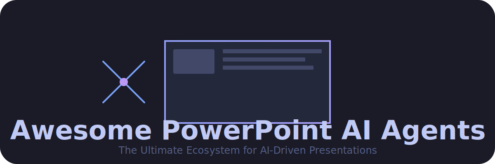
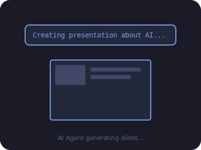

<!-- SEO Meta Tags -->
<!--
  Title: Awesome PowerPoint AI Agents - Curated List of AI Slide Generators
  Description: Discover the best AI agents for PowerPoint and slide creation. Curated list of SaaS and open-source tools like Gamma, Tome, and Presenton.
  Keywords: AI Presentation, PowerPoint AI, AI Slide Generator, Presentation Agent, Autonomous Slides, Open Source PPT AI
-->

# 🚀 Awesome PowerPoint AI Agents 🪄

**A curated ecosystem of AI agents, SaaS products, and open-source projects designed to automate slide deck creation with multi-step reasoning.**

[Features](#-key-capabilities) • [SaaS Products](#-saas-products) • [Open-Source](#-open-source-github-projects) • [Contributing](#-how-to-contribute)

---

## 🌟 Overview

This repository tracks the evolution of **AI Slide & PowerPoint Agents**. Unlike basic text-to-slide converters, these systems leverage autonomous or semi-autonomous agents to handle structure, content research, design, and speaker notes.

### ✨ Key Capabilities
- 🤖 **Agentic Reasoning**: Multi-step planning and iterative refinement.
- 📂 **Document Intelligence**: Converting PDFs, Word docs, and web URLs into slides.
- 🎨 **Smart Design**: Auto-adjusting layouts and brand-consistent themes.
- 🌍 **RAG-Style Grounding**: Using local or web data to ensure factual accuracy.

---

## 🏗️ SaaS Products

### Core Platforms (Leaderboard) 🏆

| Product | Description | Pricing | Free Tier / Trial | Company Size (Valuation/Rev) |
| :--- | :--- | :--- | :--- | :--- |
| **[Gamma](https://gamma.app/)** | **Industry Leader.** Prompt, document, or URL → complete decks with narrative flow. Features agentic storytelling. | Starts at ~$10/mo | 400 one-time credits (~10 decks); watermark included. | ~$2.1B Valuation / $100M+ ARR |
| **[Tome](https://tome.app/)** | **Sales & Narrative.** Turns ideas into story-driven decks with immersive visuals and web-like layouts. | Starts at $16/mo | Limited monthly creates; includes "Made with Tome" watermark. | ~$1.3B Valuation |
| **[PopAi](https://popai.pro/)** | **Rapid Growth.** Singapore-based productivity workspace; excellent for document-to-PPT conversion with AI outlining. | Starts at $10/mo | 1 AI presentation/week; 5 AI docs weekly. | ~1.5M+ Users / High-growth |
| **[Beautiful.ai](https://www.beautiful.ai/)** | **Design-First.** Smart Slides that auto-adjust layouts. Focuses on professional, on-brand presentations. | Starts at $12/mo | 14-day free trial (CC required); no permanent free tier. | ~$13.5M+ ARR / $60M+ Funding |
| **[Plus AI](https://www.plus.ai/)** | **Native Integration.** AI agent for Google Slides & PowerPoint. Best for existing MS/Google workflows. | Starts at $10/mo | 7-day free trial (CC required); no permanent free tier. | ~$20M - $50M Valuation (Est.) |
| **[SlidesAI.io](https://www.slidesai.io/)** | **Utility Choice.** Deep Google Slides integration with over 15M installs. Supports topic-to-presentation and document uploads. | Starts at $10/mo | 3 presentations/month; 2,500 character limit. | ~$2.6M Valuation / $1.2M+ ARR |
| **[SlideSpeak](https://slidespeak.co/)** | **Document-to-PPT.** Fast conversion from PDF/Word to editable PPTX with AI-powered redesigns. | Starts at ~$24/mo | 3 one-time credits; 50MB upload limit. | ~$2.5M Valuation (Est.) |

### Advanced & Specialized Agents 🛠️

| Product | Description | Pricing | Free Tier / Trial | Company Size (Valuation/Rev) |
| :--- | :--- | :--- | :--- | :--- |
| **[Microsoft Copilot](https://www.microsoft.com/en-us/microsoft-365/copilot)** | **Enterprise Standard.** Deep Office 365 integration with OpenAI Sora 2 support and voice-to-presentation capabilities. | ~$20 - $30/mo | Free basic version; Copilot Pro for AI features. | Trillion-Dollar Company |
| **[Canva Magic Studio](https://www.canva.com/magic-studio/)** | **Design Ecosystem.** Integrated Magic Design for prompt-to-deck within the Canva ecosystem. | Starts at ~$12.99/mo | Limited shared pool (up to 200 standard/20 premium AI uses). | ~$40B+ Valuation / $3.5B+ Rev |
| **[Jotform Agents](https://www.jotform.com/ai-presentation-generator/)** | **Maker + Presenter.** Generates slides and "presents" them with AI voice and real-time interactive Q&A. | Bundle with Jotform | Free trial available. | Billion-Dollar Private Company |
| **[Kroma.ai](https://kroma.ai/)** | **Data-Heavy.** Enterprise-ready platform focusing on data visualization, pitch decks, and brand governance. | Starts at $49.99/mo | Freemium available. | ~$20M - $40M Valuation / $4.2M+ ARR |
| **[Decktopus](https://www.decktopus.com/)** | **Business Utility.** Specialized in quick pitch decks, business proposals, and lead generation. | Starts at $14.99/mo | 3 presentations limit; watermark included. | ~$8.6M Valuation / $3M+ ARR |
| **[Presentations.AI](https://www.presentations.ai/)** | **High Volume.** Enterprise-grade with brand-safe templates and high-volume generation. | Starts at $20/mo | 100 one-time credits (4-5 decks); no export in free tier. | ~$7.9M Valuation / $2.6M+ ARR |
| **[Pi (Presentation Intelligence)](https://pi.inc/)** | **AI-Native.** Breakout 2026 leader that generates unique designs (not templates) in seconds. | Freemium | Free-forever plan with no watermarks. | Seed Stage / Emerging |
| **[SlideGMM](https://slidegmm.com/)** | **Budget Choice.** High-speed, affordable generator that exports fully editable .pptx vectors. | Starts at $4.99/mo | Free prompt-based generation / PDF export. | Seed Stage / Emerging |
| **[Prezo AI](https://prezo.ai/)** | **Multi-Format.** An all-in-one canvas that flips content between slide, document, and website formats. | Starts at ~$10/mo | Freemium available. | Seed Stage / Emerging |

---

## 🔓 Open-Source GitHub Projects

### Dedicated AI Slide / PowerPoint Agents 📂

- **[Presenton](https://github.com/presenton/presenton)** ⭐  
  The top open-source alternative. Full API, custom HTML/Tailwind templates, and local LLM support (Ollama/Docker).
- **[presentation-ai (ALLWEONE)](https://github.com/allweonedev/presentation-ai)** 📂  
  Next.js-based AI generator with customizable themes. Excellent for self-hosting.
- **[SlideDeck AI](https://github.com/barun-saha/slide-deck-ai)** 🧠  
  Co-creation assistant using LLMs (supports offline Ollama) to generate native PPTX.
- **[PPTAgent](https://github.com/icip-cas/PPTAgent)** 🔬  
  Agentic framework for reflective PowerPoint generation (EMNLP paper). Focuses on multi-step reasoning and research integration.
- **[ChillDeck](https://github.com/Isha-upadhyay/ChillDeck)** ❄️  
  Multi-agent generator using LangChain + LangGraph for research-backed decks.
- **[slideitin](https://github.com/martin226/slideitin)** 📄  
  Document-to-slides agent using Google Gemini. Perfect for quick conversions.

### Community Favorites & Tools 🛠️
- **[SlidesGenie](https://github.com/raphaeltony/SlidesGenie)** — Topic-to-Google Slides (ChatGPT + DALL-E).
- **[slidemason](https://github.com/erickittelson/slidemason)** — 100% local builder (zero API keys).
- **[SlideAI](https://github.com/siddhesh-desai/SlideAI)** — Automatic PPT maker using OpenAI/Bing.
- **[nooqta/ai-presentation](https://github.com/nooqta/ai-presentation)** — Markdown to Reveal.js via AI.

---

## 🤝 How to Contribute

Contributions make the community awesome! 

1. **Fork** the Project.
2. **Create** your Feature Branch (`git checkout -b feature/AmazingTool`).
3. **Commit** your Changes (`git commit -m 'Add some AmazingTool'`).
4. **Push** to the Branch (`git push origin feature/AmazingTool`).
5. **Open** a Pull Request.

---

## 📈 Star History

---

## 📝 Disclaimer

- This is a community-curated list and not an endorsement.
- Verify data privacy and licensing before using these tools for sensitive data.
- AI-generated content should always be reviewed for brand compliance and factual accuracy.

---

  <b>Made with ❤️ for creators, marketers, and developers.</b> 
  <i>Let's make presentation creation 10x faster and fully controllable.</i>

<!-- Tags for SEO -->
<!-- AI, PowerPoint, AI Agents, Slides, Gamma, Tome, Beautiful.ai, Open Source, LLM, Ollama, LangChain -->
mit** your Changes (`git commit -m 'Add some AmazingTool'`).
4. **Push** to the Branch (`git push origin feature/AmazingTool`).
5. **Open** a Pull Request.

---

## 📈 Star History

---

## 📝 Disclaimer

- This is a community-curated list and not an endorsement.
- Verify data privacy and licensing before using these tools for sensitive data.
- AI-generated content should always be reviewed for brand compliance and factual accuracy.

---

  <b>Made with ❤️ for creators, marketers, and developers.</b> 
  <i>Let's make presentation creation 10x faster and fully controllable.</i>

<!-- Tags for SEO -->
<!-- AI, PowerPoint, AI Agents, Slides, Gamma, Tome, Beautiful.ai, Open Source, LLM, Ollama, LangChain -->
